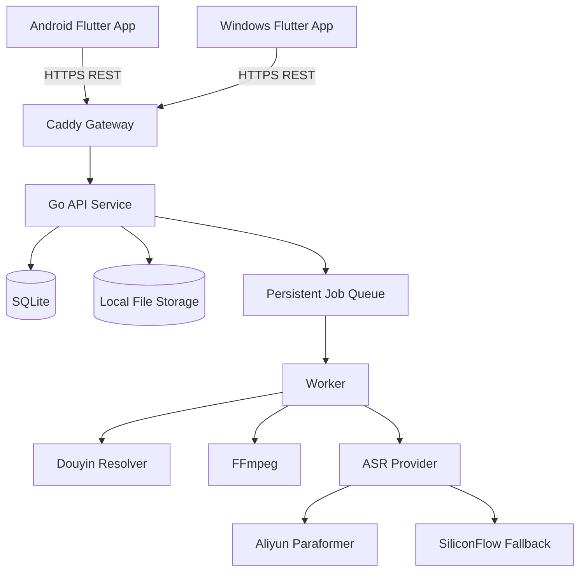
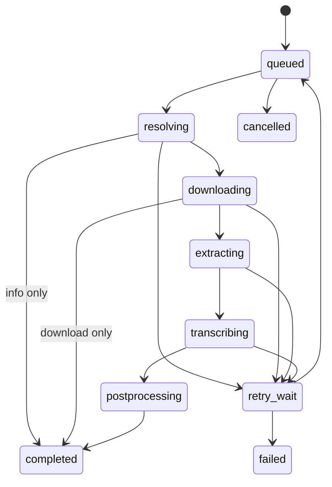

# Douyin Capture 多端内容提取系统

## 完整产品与技术设计文档

**目标平台：** Android、Windows、Linux 服务端  
**建议技术栈：** Flutter + Go + SQLite + FFmpeg + 云端 ASR  
**文档版本：** 1.0  
**状态：** 可进入实施  
**日期：** 2026-08-11  
**主要读者：** 产品负责人、架构师、开发者、测试人员、AI 编码助手

---

## 0. 给 AI 编码助手的执行指令

本文件是系统的主规格书。实施时应遵循以下规则：

1. 先阅读全文，再建立任务清单；不得只按单一章节局部实现。
2. 默认采用本文“已确定决策”，除非负责人明确变更，不要自行替换技术栈、数据库、认证方案或 ASR 供应商。
3. 每个里程碑都必须包含代码、自动化测试、迁移脚本、配置示例、运行文档和验收记录。
4. 不得把 ASR API Key、登录密钥、数据库密码写入客户端、代码仓库、日志或异常响应。
5. 抖音解析、媒体处理、ASR、文件存储必须通过接口解耦，禁止把所有逻辑写进一个控制器或单文件脚本。
6. 所有外部网络请求必须设置超时、重试上限、User-Agent、响应大小限制和可观测日志。
7. 所有涉及文件路径、远程 URL、下载代理的入口都必须防止路径穿越、SSRF 和任意 URL 代理。
8. 第一版只允许一个后台任务同时转写；架构应允许未来通过配置提升并发。
9. Android 与 Windows 必须共用 Flutter 业务层和 UI 组件，平台差异只能进入 `platform/` 适配层。
10. 每完成一个里程碑，先运行测试与安全检查，再进入下一阶段。

### 0.1 实施输出要求

AI 助手最终应产生以下仓库结构：

```text
douyin-capture/
├── apps/
│   └── client_flutter/          # Android + Windows
├── services/
│   └── api_go/                  # Go 服务端
├── deploy/
│   ├── systemd/
│   ├── caddy/
│   └── docker/                  # 可选部署方式
├── docs/
│   ├── api/
│   ├── operations/
│   ├── security/
│   └── decisions/
├── scripts/
└── README.md
```

---

## 1. 产品概述

Douyin Capture 是一个面向少量可信用户的多端内容提取工具。用户在 Android 或 Windows 应用中粘贴抖音分享链接，或在 Android 抖音分享面板中直接选择本应用，系统在服务器端解析作品信息、获取无水印媒体、提取图文内容，并按需调用云端语音识别服务生成视频口播文案。

系统的核心价值是：

- 用户端无需命令行、Python、FFmpeg 或本地模型。
- Android 与 Windows 使用相同账号、历史记录和任务结果。
- 服务器不运行 Whisper，不需要 GPU 或大内存。
- ASR 供应商可替换，避免被单个平台锁定。
- 抖音解析逻辑集中在服务端，规则变化无需重新发布客户端。
- 提供结构化 Markdown、纯文本、视频和图片导出能力。

### 1.1 目标用户

- 主要用户：系统所有者。
- 次要用户：一名受邀请的协作者。
- 初始规模：2 个固定账号。
- 预期负载：每日 0-50 个任务，绝大多数视频少于 15 分钟。

### 1.2 核心使用场景

1. Android 用户从抖音分享视频到本应用，提取完整口播。
2. Windows 用户复制抖音链接，在桌面应用中粘贴并提取文案。
3. 用户仅获取标题、作者、发布文案、图片或无水印视频，不调用 ASR。
4. 用户查看跨设备历史记录，重新复制或下载已有结果。
5. 管理员查看任务失败原因、ASR 用量和存储占用。

### 1.3 产品目标

- 普通任务从提交到进入队列不超过 2 秒。
- 作品信息解析在网络正常时 10 秒内完成。
- 用户可以明确看到排队、下载、音频处理、转写和完成状态。
- 同一链接重复提交不会无意义地重复收费。
- 服务器故障或重启后任务状态可恢复，不出现永久“处理中”。
- 客户端从首次安装到完成第一个任务不超过 3 分钟。

### 1.4 非目标

第一版明确不做：

- 抖音账号登录、关注、点赞、评论、发布内容。
- 批量爬取作者主页或无限量抓取。
- 绕过平台访问控制、付费内容或地区限制。
- 视频编辑、二次创作和自动发布。
- 本地 Whisper 或其他本地 ASR 模型。
- 面向公众的开放注册、多租户计费和商业 SaaS。
- iOS、macOS、Linux 桌面客户端；架构保留扩展可能。

---

## 2. 已确定的关键决策

| 编号 | 决策 | 说明 |
|---|---|---|
| ADR-001 | Flutter 构建 Android 与 Windows | 一套 UI 与业务代码，保留平台适配层 |
| ADR-002 | Go 构建服务端 REST API | 单二进制、低内存、便于并发与部署 |
| ADR-003 | SQLite 作为第一版数据库 | 两人使用，无需独立数据库服务 |
| ADR-004 | FFmpeg 只运行在服务器 | 客户端保持轻量，统一媒体处理行为 |
| ADR-005 | 云端 ASR，不使用本地 Whisper | 默认阿里云 Paraformer，硅基流动作为备用适配器 |
| ADR-006 | 后台异步任务 | 提交后轮询状态，避免长 HTTP 请求超时 |
| ADR-007 | 默认单 Worker | 控制服务器资源与 ASR 并发，未来可配置扩展 |
| ADR-008 | 两个预创建账号，不开放注册 | 降低攻击面和产品复杂度 |
| ADR-009 | 服务器保存 API Key | 客户端永远不能接触第三方密钥 |
| ADR-010 | REST + 轮询，不上 WebSocket | 第一版简单可靠；轮询间隔可动态调整 |
| ADR-011 | Caddy 提供 HTTPS | 自动证书、反向代理与请求限制 |
| ADR-012 | 结果按用户隔离 | 即使只有两人，也不得默认互看私人任务 |

---

## 3. 系统上下文与总体架构



### 3.1 组件职责

**Flutter 客户端**

- 登录与 Token 管理。
- 接收分享、粘贴链接、提交任务。
- 展示任务进度、结果和历史记录。
- 下载、复制、分享结果。
- 本地缓存最近访问内容，但不保存 ASR 密钥。

**Go API 服务**

- 身份认证和权限验证。
- 请求校验、幂等处理和速率限制。
- 任务创建、查询、取消、删除和重试。
- 文件下载授权和审计。
- 管理员统计与健康检查。

**Worker**

- 持久化领取任务。
- 解析作品、下载媒体、执行 FFmpeg。
- 调用 ASR、标准化结果、生成 Markdown。
- 维护进度、心跳、重试和清理。

**SQLite**

- 用户、刷新令牌、任务、作品、文件、ASR 调用和审计日志。
- 使用 WAL 模式、外键和事务。

**本地文件存储**

- 临时媒体和可下载结果。
- 通过数据库记录归属、哈希、大小、MIME 和过期时间。

---

## 4. 功能需求

### 4.1 身份认证

#### FR-AUTH-001 账号

- 系统初始仅有管理员和普通用户两个账号。
- 不提供公开注册、找回密码和第三方登录。
- 管理员通过服务端管理命令创建、禁用、重置账号。
- 用户名不区分大小写，存储规范化值。

#### FR-AUTH-002 登录

- 用户名和密码登录。
- Access Token 默认 15 分钟有效。
- Refresh Token 默认 30 天有效，支持轮换与撤销。
- 客户端使用系统安全存储保存 Refresh Token。
- 密码使用 Argon2id；禁止明文、可逆加密或弱哈希。

#### FR-AUTH-003 设备会话

- 每次登录登记设备名称、平台、应用版本和最后访问时间。
- 用户可以查看并注销其他设备。
- 管理员可以撤销任意会话。

### 4.2 链接输入与规范化

#### FR-INPUT-001 支持输入

- `https://v.douyin.com/...` 短链接。
- `https://www.douyin.com/video/{id}`。
- `https://www.douyin.com/note/{id}`。
- `https://www.iesdouyin.com/share/video/{id}`。
- 包含上述 URL 的整段分享文案。

#### FR-INPUT-002 规范化

- 从分享文本中只提取首个允许域名的 HTTPS URL。
- 跟随重定向时最多 5 跳。
- 每一跳重新验证域名、协议、DNS 解析结果和目标 IP。
- 禁止 `file:`、`ftp:`、`data:`、`localhost`、私网 IP、云元数据地址。
- 生成 canonical URL 和作品 ID，用于幂等与缓存。

### 4.3 作品解析

#### FR-RESOLVE-001 视频作品

至少返回：

- 作品 ID
- 作者 ID、昵称
- 标题或 `desc`
- 发布时间（可用时）
- 封面地址
- 视频播放地址
- 媒体时长、宽高（可用时）
- 话题标签
- 原始解析来源和解析器版本

#### FR-RESOLVE-002 图文作品

除通用字段外返回：

- 图片地址列表及顺序
- 图片宽高（可用时）
- 发布文案
- 图文作品不默认执行 OCR 或 ASR

#### FR-RESOLVE-003 解析策略

按顺序尝试：

1. 短链接解析与 canonical URL 获取。
2. `iesdouyin.com/share/...` SSR 数据中的 `window._ROUTER_DATA`。
3. 兼容 `RENDER_DATA` 的备用解析器。
4. 已知作品 ID 的分享页重建。

每个解析器必须实现相同接口，并返回结构化错误，不能依赖字符串匹配判断失败。

#### FR-RESOLVE-004 缓存

- 成功解析结果默认缓存 6 小时。
- 媒体临时 URL 过期后允许重新解析刷新。
- 解析器版本变化时可以使旧缓存失效。

### 4.4 任务创建

#### FR-JOB-001 操作类型

支持以下 `action`：

- `info`：只解析元数据。
- `download`：生成可下载的无水印媒体。
- `transcribe`：视频口播转写。
- `full`：解析、下载并转写。

#### FR-JOB-002 幂等

- 客户端为每次提交生成 `Idempotency-Key`。
- 服务端保存 24 小时；相同用户、相同 Key 返回原任务。
- 相同用户、相同作品、相同 action、相同 ASR 配置且已有未过期成功结果时，默认复用结果。
- UI 提供“强制重新处理”，必须二次确认会产生额外 API 费用。

#### FR-JOB-003 取消

- 排队任务可立即取消。
- 下载或 FFmpeg 阶段应尽快终止子进程。
- 已提交云端 ASR 后如供应商不支持取消，则标记“取消等待”，忽略最终结果并记录费用。

### 4.5 媒体处理

#### FR-MEDIA-001 下载

- 只允许下载解析器产生且与当前作品绑定的 URL。
- 单个视频默认最大 2 GB，可配置。
- 下载设置连接超时 10 秒、总超时按大小动态计算。
- 流式写入临时文件，不能一次性读入内存。
- 计算 SHA-256、MIME、字节数并校验磁盘配额。

#### FR-MEDIA-002 音频提取

默认输出：

```text
格式：MP3
采样率：16 kHz
声道：Mono
码率：48 kbps
```

- FFmpeg 通过参数数组启动，禁止拼接 Shell 命令。
- 子进程必须设置超时、工作目录、日志截断和退出码检查。
- 转写成功后立即删除临时音频。

#### FR-MEDIA-003 分段

- 当供应商文件大小或时长限制将被突破时执行分段。
- 默认每段 9 分钟，段间重叠 1 秒以降低断句丢失。
- 结果按时间顺序合并，并对重叠文本执行保守去重。
- 保存每段开始、结束、供应商请求 ID 和失败信息。

### 4.6 云端 ASR

#### FR-ASR-001 统一接口

```go
type Provider interface {
    Name() string
    Validate(ctx context.Context) error
    Transcribe(ctx context.Context, req TranscribeRequest) (TranscribeResult, error)
}
```

`TranscribeRequest` 至少包含音频来源、语言提示、上下文热词、任务 ID、超时和回调信息。`TranscribeResult` 至少包含全文、分段、语言、时长、计费量、请求 ID 和原始响应摘要。

#### FR-ASR-002 默认供应商

- 默认 `aliyun_paraformer`。
- 默认模型 `paraformer-v2` 或部署时确认的最新稳定非实时模型。
- API Key 仅从服务器 Secret/环境变量读取。
- 供应商价格、免费额度和模型名不得硬编码进客户端。

#### FR-ASR-003 备用供应商

- 可配置 `siliconflow_sensevoice`。
- 只有主供应商出现可重试服务错误、超时或限流时才允许自动切换。
- 认证失败、余额不足、输入违规时不得自动切换，以免重复收费或掩盖配置错误。

#### FR-ASR-004 费用控制

- 每次调用前估算音频时长和预计费用。
- 保存实际供应商、模型、计费时长和费用估算。
- 支持每日和每月预算阈值。
- 达到硬上限后拒绝新转写，只允许 `info` 和 `download`。
- 管理页展示当月总时长、成功率、平均耗时和预计费用。

### 4.7 结果处理

#### FR-RESULT-001 文案标准化

- 保留 ASR 原始全文。
- 生成标准化全文：Unicode NFC、规范换行、移除不可见控制字符。
- 不擅自改写内容，不自动“润色”事实。
- 可选执行标点与段落整理，但必须保留原始结果并标识处理版本。

#### FR-RESULT-002 Markdown 导出

格式如下：

```markdown
---
source: douyin
video_id: "123456"
author: "作者昵称"
source_url: "https://..."
captured_at: "2026-08-11T12:00:00Z"
asr_provider: "aliyun_paraformer"
---

# 标题

## 发布文案

原始 desc

## 口播文案

识别后的正文
```

#### FR-RESULT-003 文件类型

- `result.md`
- `result.txt`
- `meta.json`
- `video.mp4`（按请求保留）
- `images/01.jpg...`（图文）

### 4.8 历史记录

- 默认按创建时间倒序。
- 支持按状态、类型、作者、关键词、日期筛选。
- 支持搜索标题、发布文案和口播全文。
- 用户只能查看自己的任务；管理员可在管理模式查看全部。
- 支持删除单个任务及其文件。
- 失败任务可以重试；重试创建新 attempt，但保持同一逻辑任务 ID。

### 4.9 通知

**Android**

- 任务完成、失败时发送本地通知。
- 应用在后台时由客户端周期同步；正式公网版本可增加 FCM 推送。
- 点击通知打开对应结果页。

**Windows**

- 使用系统 Toast 通知。
- 点击通知聚焦应用并打开结果页。
- 可选系统托盘，不作为 MVP 阻塞项。

### 4.10 管理功能

- 查看健康状态、版本、数据库状态、剩余磁盘。
- 查看当前任务、队列长度、Worker 心跳。
- 查看 ASR 调用统计和预算。
- 禁用/启用用户、撤销会话、重置密码。
- 手动重试、取消、清理任务。
- 修改非敏感运行参数；密钥仍通过服务器 Secret 管理。

---

## 5. 客户端设计（Flutter）

### 5.1 包结构

```text
lib/
├── app/
│   ├── app.dart
│   ├── router.dart
│   └── theme.dart
├── core/
│   ├── api/
│   ├── auth/
│   ├── errors/
│   ├── storage/
│   └── widgets/
├── features/
│   ├── login/
│   ├── capture/
│   ├── jobs/
│   ├── result/
│   ├── settings/
│   └── admin/
└── platform/
    ├── share_receiver/
    ├── notifications/
    ├── downloads/
    └── window_manager/
```

### 5.2 推荐依赖

- 状态管理：Riverpod。
- HTTP：Dio。
- 路由：go_router。
- 不敏感缓存：Drift/SQLite。
- Token 安全存储：flutter_secure_storage。
- 通知：flutter_local_notifications。
- 文件选择与打开：file_picker、open_filex 或等价维护良好的组件。

依赖必须锁定版本并经过 Android、Windows 双端验证；不要引入只支持移动端的核心依赖。

### 5.3 页面清单

| 页面 | 主要内容 |
|---|---|
| 启动页 | 初始化、Token 刷新、最低版本检查 |
| 登录页 | 用户名、密码、服务器不可达提示 |
| 首页/提交页 | 分享文本输入、操作类型、提交按钮 |
| 解析预览 | 标题、作者、封面、类型、预计操作 |
| 任务详情 | 状态时间线、进度、取消/重试 |
| 结果页 | 发布文案、口播文案、复制、下载、分享 |
| 历史页 | 搜索、筛选、分页、删除 |
| 设置页 | 下载目录、通知、主题、退出登录 |
| 设备会话页 | 当前设备与其他登录设备 |
| 管理页 | 队列、磁盘、用量、用户（管理员） |

### 5.4 Android 特定要求

- 注册 `ACTION_SEND`，接收 `text/plain`。
- 接收分享后先显示确认页，不自动产生收费任务。
- 支持从剪贴板粘贴，但未经用户动作不得持续监听剪贴板。
- 下载优先使用系统目录或 Storage Access Framework。
- 遵循 Android 后台执行限制；任务处理在服务器，客户端只同步状态。
- APK/AAB 使用正式签名；签名密钥不得进入仓库。

### 5.5 Windows 特定要求

- 支持 Windows 10 1809+ 与 Windows 11。
- 提供 MSI/MSIX 或 Setup EXE 安装包。
- 默认下载到用户选择的目录。
- 支持单实例；第二次启动把链接传给已有窗口。
- 支持 `douyincapture://capture?url=...` 深链接（第二阶段）。
- 自动更新必须签名并校验更新包哈希。

### 5.6 状态与轮询

- 提交成功后立即进入任务详情。
- `queued/resolving` 每 2 秒轮询。
- `downloading/extracting/transcribing` 每 3 秒轮询。
- 应用在后台时降低到 15-30 秒。
- 完成、失败、取消后停止轮询。
- 网络恢复后自动继续，不重复创建任务。

### 5.7 客户端错误体验

错误信息必须同时包含：

- 用户可理解的标题。
- 简短原因。
- 可执行的下一步，如重试、检查链接、联系管理员。
- 可复制的请求 ID；不得显示堆栈、密钥、内部路径。

---

## 6. 服务端设计（Go）

### 6.1 包结构

```text
services/api_go/
├── cmd/server/main.go
├── internal/
│   ├── auth/
│   ├── config/
│   ├── database/
│   ├── httpapi/
│   ├── jobs/
│   ├── resolver/
│   ├── media/
│   ├── asr/
│   ├── files/
│   ├── cleanup/
│   ├── metrics/
│   └── audit/
├── migrations/
├── testdata/
├── go.mod
└── go.sum
```

### 6.2 分层规则

- HTTP Handler：鉴权、输入校验、调用 Use Case、映射响应。
- Use Case：业务编排和事务边界。
- Repository：数据库访问。
- Adapter：抖音、FFmpeg、ASR、文件系统等外部能力。
- Domain：实体、值对象、状态机和领域错误。

禁止 Handler 直接执行 SQL、FFmpeg 或第三方 HTTP 请求。

### 6.3 配置

所有配置从环境变量或只读配置文件读取。启动时验证必需值，错误时拒绝启动。

```text
APP_ENV=production
HTTP_ADDR=127.0.0.1:8080
PUBLIC_BASE_URL=https://capture.example.com
DATABASE_PATH=/var/lib/douyin-capture/app.db
DATA_DIR=/var/lib/douyin-capture/data
JWT_SIGNING_KEY_FILE=/run/secrets/jwt.key
ACCESS_TOKEN_TTL=15m
REFRESH_TOKEN_TTL=720h
ASR_PROVIDER=aliyun_paraformer
ALIYUN_DASHSCOPE_API_KEY=...
SILICONFLOW_API_KEY=...
FFMPEG_PATH=/usr/bin/ffmpeg
FFPROBE_PATH=/usr/bin/ffprobe
WORKER_CONCURRENCY=1
MAX_VIDEO_BYTES=2147483648
MONTHLY_ASR_BUDGET_CNY=20
RETENTION_VIDEO_HOURS=168
RETENTION_TEMP_HOURS=24
LOG_LEVEL=info
```

### 6.4 优雅关闭

- 收到 SIGTERM 后停止接受新任务。
- 等待当前数据库事务完成。
- Worker 在安全检查点释放任务或完成当前步骤。
- FFmpeg 子进程收到终止信号并在超时后强制结束。
- 关闭前更新 Worker 心跳和任务状态。

---

## 7. 任务队列与状态机



### 7.1 状态定义

| 状态 | 是否终态 | 描述 |
|---|---:|---|
| `queued` | 否 | 等待 Worker |
| `resolving` | 否 | 解析链接与作品信息 |
| `downloading` | 否 | 下载媒体 |
| `extracting` | 否 | FFmpeg 处理音频 |
| `transcribing` | 否 | 云端 ASR |
| `postprocessing` | 否 | 合并、标准化、生成文件 |
| `retry_wait` | 否 | 等待退避后重试 |
| `completed` | 是 | 成功 |
| `failed` | 是 | 达到重试上限或不可重试错误 |
| `cancelled` | 是 | 用户或管理员取消 |

### 7.2 持久化领取

- Worker 在事务中领取最早的 `queued` 任务。
- 写入 `lease_owner`、`lease_expires_at` 和 `heartbeat_at`。
- 心跳默认每 15 秒更新。
- Lease 默认 60 秒；进程崩溃后由恢复器重新入队。
- 每个阶段写入进度 0-100 和 `status_message`。

### 7.3 重试策略

| 错误类型 | 策略 |
|---|---|
| 网络超时、502/503/504 | 最多 3 次，指数退避加随机抖动 |
| 429 限流 | 按 `Retry-After`，否则 30/60/120 秒 |
| 抖音解析结构变化 | 依次尝试备用解析器，之后失败 |
| 401/403 API Key | 不重试，提示管理员配置 |
| 余额不足/预算超限 | 不重试，保留媒体并允许稍后重试 |
| 输入不支持、作品不存在 | 不重试 |
| FFmpeg 临时失败 | 1 次重试，保存截断日志 |

### 7.4 恢复规则

服务启动时：

- 查找非终态且 Lease 已过期的任务。
- 如果处于 ASR 阶段并保存了供应商任务 ID，先查询供应商状态，不能直接重新提交。
- 临时文件存在且哈希匹配时复用；否则回退到最近安全阶段。
- 超过最大 attempt 次数后标记失败。

---

## 8. 数据库设计

### 8.1 通用规则

- SQLite 开启 WAL、foreign_keys、busy_timeout。
- 时间统一 UTC，ISO 8601 输出，数据库存整数毫秒或 RFC3339 字符串，项目内只能选一种。
- 主键使用 ULID，作品 ID 保持字符串，防止整数溢出。
- 所有表包含 `created_at`；可变实体包含 `updated_at`。
- 数据库迁移只能向前执行，并在发布前测试升级与回滚备份。

### 8.2 表结构

#### users

```text
id TEXT PK
username_normalized TEXT UNIQUE
display_name TEXT
password_hash TEXT
role TEXT CHECK(admin,user)
is_active INTEGER
created_at INTEGER
updated_at INTEGER
last_login_at INTEGER NULL
```

#### refresh_tokens

```text
id TEXT PK
user_id TEXT FK
token_hash TEXT UNIQUE
device_id TEXT
device_name TEXT
platform TEXT
app_version TEXT
expires_at INTEGER
revoked_at INTEGER NULL
replaced_by TEXT NULL
created_at INTEGER
last_used_at INTEGER
```

#### works

```text
id TEXT PK                 # 内部 ULID
douyin_work_id TEXT UNIQUE
content_type TEXT          # video/note
canonical_url TEXT
author_id TEXT NULL
author_name TEXT NULL
title TEXT
description TEXT
cover_url TEXT NULL
published_at INTEGER NULL
metadata_json TEXT
resolver_name TEXT
resolver_version TEXT
resolved_at INTEGER
created_at INTEGER
updated_at INTEGER
```

#### jobs

```text
id TEXT PK
user_id TEXT FK
work_id TEXT NULL FK
input_text TEXT
input_url TEXT
action TEXT
status TEXT
progress INTEGER
status_message TEXT
idempotency_key TEXT
force_refresh INTEGER
attempt_count INTEGER
max_attempts INTEGER
lease_owner TEXT NULL
lease_expires_at INTEGER NULL
heartbeat_at INTEGER NULL
error_code TEXT NULL
error_message TEXT NULL
started_at INTEGER NULL
completed_at INTEGER NULL
created_at INTEGER
updated_at INTEGER
UNIQUE(user_id,idempotency_key)
```

#### job_steps

```text
id TEXT PK
job_id TEXT FK
step_name TEXT
attempt INTEGER
status TEXT
started_at INTEGER
completed_at INTEGER NULL
details_json TEXT
error_code TEXT NULL
error_message TEXT NULL
```

#### files

```text
id TEXT PK
user_id TEXT FK
job_id TEXT FK
kind TEXT
relative_path TEXT
original_name TEXT
mime_type TEXT
size_bytes INTEGER
sha256 TEXT
expires_at INTEGER NULL
created_at INTEGER
deleted_at INTEGER NULL
```

#### asr_calls

```text
id TEXT PK
job_id TEXT FK
provider TEXT
model TEXT
provider_request_id TEXT NULL
segment_index INTEGER
audio_seconds REAL
billed_seconds REAL NULL
estimated_cost_cny REAL
status TEXT
response_summary_json TEXT
started_at INTEGER
completed_at INTEGER NULL
error_code TEXT NULL
```

#### audit_logs

```text
id TEXT PK
actor_user_id TEXT NULL
action TEXT
target_type TEXT
target_id TEXT NULL
request_id TEXT
ip_hash TEXT NULL
metadata_json TEXT
created_at INTEGER
```

### 8.3 索引

- `jobs(user_id, created_at DESC)`
- `jobs(status, created_at)`
- `jobs(lease_expires_at)`
- `works(douyin_work_id)`
- `files(job_id, kind)`
- `asr_calls(job_id, segment_index)`
- `refresh_tokens(user_id, revoked_at, expires_at)`
- FTS5：`works.title`、`works.description`、最终转写文本（第二阶段）。

---

## 9. REST API 契约

### 9.1 通用约定

- Base URL：`https://capture.example.com/api/v1`
- JSON 使用 UTF-8。
- 时间使用 RFC3339 UTC。
- 成功响应包含 `requestId`。
- 错误使用统一结构。
- 分页使用 cursor，不使用不稳定的页码偏移。
- 所有写请求支持请求体最大值限制。

### 9.2 统一错误格式

```json
{
  "error": {
    "code": "DOUYIN_RESOLVE_FAILED",
    "message": "无法解析该作品，请确认链接仍然有效",
    "retryable": false,
    "requestId": "01J...",
    "details": {}
  }
}
```

`details` 只能包含安全、可公开的数据。

### 9.3 认证接口

#### POST `/auth/login`

请求：

```json
{
  "username": "user",
  "password": "********",
  "device": {
    "id": "installation-uuid",
    "name": "Rich-PC",
    "platform": "windows",
    "appVersion": "1.0.0"
  }
}
```

响应：

```json
{
  "accessToken": "...",
  "accessTokenExpiresAt": "2026-08-11T12:15:00Z",
  "refreshToken": "...",
  "user": {"id":"01J...","displayName":"Rich","role":"admin"},
  "requestId": "01J..."
}
```

其他接口：

- `POST /auth/refresh`
- `POST /auth/logout`
- `GET /auth/sessions`
- `DELETE /auth/sessions/{id}`

### 9.4 任务接口

#### POST `/jobs`

Header：`Idempotency-Key: <uuid>`

```json
{
  "shareText": "复制打开抖音 https://v.douyin.com/xxx/",
  "action": "transcribe",
  "options": {
    "keepVideo": false,
    "asrProvider": "default",
    "languageHints": ["zh"],
    "force": false
  }
}
```

响应 `202 Accepted`：

```json
{
  "job": {
    "id": "01J...",
    "status": "queued",
    "progress": 0,
    "createdAt": "2026-08-11T12:00:00Z"
  },
  "reused": false,
  "requestId": "01J..."
}
```

#### GET `/jobs/{id}`

```json
{
  "job": {
    "id": "01J...",
    "action": "transcribe",
    "status": "transcribing",
    "progress": 72,
    "statusMessage": "正在识别第 2/3 段",
    "work": {
      "id": "01J...",
      "douyinWorkId": "123456",
      "type": "video",
      "title": "示例标题",
      "authorName": "作者",
      "coverUrl": "/api/v1/files/..."
    },
    "result": null,
    "error": null,
    "createdAt": "...",
    "updatedAt": "..."
  },
  "requestId": "01J..."
}
```

其他任务接口：

- `GET /jobs?cursor=&limit=20&status=&type=&query=`
- `POST /jobs/{id}/cancel`
- `POST /jobs/{id}/retry`
- `DELETE /jobs/{id}`

### 9.5 文件接口

- `GET /files/{id}`：鉴权后下载。
- 支持 `Range`，用于视频播放和断点续传。
- `Content-Disposition` 文件名必须安全编码。
- 不接受任意远程 URL 参数。
- 文件记录必须属于当前用户或当前管理员请求。

### 9.6 管理接口

- `GET /admin/health`
- `GET /admin/stats`
- `GET /admin/jobs`
- `POST /admin/jobs/{id}/cancel`
- `GET /admin/users`
- `POST /admin/users/{id}/disable`
- `POST /admin/users/{id}/reset-password`
- `POST /admin/cleanup/run`

---

## 10. 安全设计

### 10.1 威胁模型

重点防御：

- 未授权用户调用 ASR 消耗费用。
- API Key 被客户端、日志或错误响应泄露。
- SSRF 访问服务器内网或云元数据。
- 下载代理被滥用为开放代理。
- 路径穿越读取其他文件。
- 恶意超大媒体耗尽磁盘、内存或流量。
- FFmpeg 参数注入和恶意媒体文件。
- Token 重放、暴力登录和会话盗用。
- 抖音页面内容携带的提示注入影响后续 AI 功能。

### 10.2 必须实施的控制

- 仅允许 HTTPS。
- 登录限速：每 IP 与账号 5 次/分钟，逐步延迟。
- API 总限速：普通用户 30 请求/分钟；提交任务 10 次/小时。
- URL allowlist + DNS/IP 双重校验，每次重定向重新验证。
- 禁止访问 RFC1918、loopback、link-local、multicast、IPv6 私网及 `169.254.169.254`。
- 下载响应大小和时间双重限制。
- 临时目录权限 `0700`，文件默认 `0600`。
- 相对路径入库，使用安全 join 后验证仍位于数据根目录。
- FFmpeg 以低权限服务账号运行，可选 systemd sandbox。
- 日志自动脱敏 Authorization、Cookie、API Key、Token、URL 查询敏感字段。
- Refresh Token 只存哈希。
- 数据库和数据目录每日备份，备份加密。

### 10.3 Caddy 边界

- 请求体上限。
- HTTPS 与 HSTS。
- 安全响应头：`X-Content-Type-Options`、`Referrer-Policy`、适当 CSP。
- 只反向代理 API，不暴露数据目录。
- 管理接口可进一步限制来源网络。

### 10.4 隐私

- 转写音频会发送给选定云端供应商，首次使用时明确提示。
- 隐私页列出供应商、用途和保留策略。
- 用户删除任务后，系统删除本地文件和可识别元数据；审计日志保留最小事件记录。
- 不将用户媒体用于训练、分析或模型改进，除非另行取得明确同意。

---

## 11. 非功能需求

### 11.1 性能

- API P95（不含外部解析/ASR）小于 300 ms。
- 服务端空闲内存目标小于 150 MB；不含系统页缓存。
- 下载和文件返回必须流式处理。
- Worker 并发默认 1，可配置为 2；不得无界创建 goroutine。

### 11.2 可靠性

- 目标月可用性 99%，不对第三方抖音与 ASR 故障负责。
- 任务状态必须持久化。
- 任何任务失败不得导致服务进程退出。
- 数据库写操作使用事务；关键文件采用临时名写入后原子重命名。

### 11.3 兼容性

- Android：建议最低 Android 8/API 26，可按目标设备调整。
- Windows：Windows 10 1809+、Windows 11。
- 服务端：Ubuntu 22.04/24.04 amd64；未来可构建 arm64。

### 11.4 可维护性

- Go 单元测试覆盖核心领域和安全校验，目标 80% 以上。
- Flutter 核心状态与页面逻辑覆盖，关键流程必须有集成测试。
- 外部接口均提供 Fake Adapter，测试不得依赖真实收费 API。
- 所有数据库迁移、环境变量、错误码都有文档。

### 11.5 可访问性

- 支持系统文字缩放，关键按钮不因 200% 字号截断。
- 颜色对比符合 WCAG AA 基本要求。
- 所有图标按钮提供语义标签和工具提示。
- Windows 支持键盘导航，Android 支持 TalkBack 基础读取。

---

## 12. 日志、指标与审计

### 12.1 结构化日志

每条日志至少包含：

```text
timestamp
level
service
version
request_id
job_id（可选）
user_id（哈希或内部ID）
event
duration_ms（可选）
error_code（可选）
```

禁止记录完整分享文案、Token、API Key、音频正文和供应商原始响应。

### 12.2 指标

- HTTP 请求数、状态码、延迟。
- 队列长度、任务状态、任务阶段耗时。
- 抖音解析成功率及解析器分布。
- 下载字节数、失败率。
- FFmpeg 耗时和失败率。
- ASR 调用次数、音频时长、预计费用、限流和错误率。
- 数据库大小、磁盘剩余、临时文件大小。

第一版可提供 `/metrics` 给 Prometheus，也可先通过管理接口展示聚合数据。

### 12.3 健康检查

- `/health/live`：进程存活，不依赖外部服务。
- `/health/ready`：数据库可写、数据目录可写、Worker 正常。
- 第三方 ASR 状态单独展示，不应导致整个服务 Readiness 长期失败。

---

## 13. 文件与数据保留

| 数据 | 默认保留 | 规则 |
|---|---:|---|
| 临时下载文件 | 24 小时以内 | 成功后立即清理；崩溃残留由定时任务清理 |
| 临时音频 | 转写完成即删 | 最长 24 小时 |
| 用户选择保留的视频 | 7 天 | 可配置，过期可重新解析下载 |
| 图文图片 | 7 天 | 可配置 |
| Markdown/TXT/meta | 长期 | 用户删除任务时删除 |
| 任务记录 | 长期 | 用户可删除 |
| 审计日志 | 90 天 | 只保留最小事件信息 |
| Refresh Token | 到期或撤销后 30 天 | 用于安全审计，之后删除 |

清理任务每天运行一次，并在每次启动后延迟 5 分钟运行一次。

---

## 14. 部署设计

### 14.1 推荐服务器

两人使用的推荐配置：

```text
2 vCPU
2 GB RAM
20-50 GB SSD
Ubuntu 24.04 LTS
稳定访问抖音和 ASR 供应商的网络
```

### 14.2 生产进程

- `douyin-capture-api.service`：Go 服务与 Worker。
- `caddy.service`：HTTPS 和反向代理。
- `douyin-capture-backup.timer`：数据库备份。
- `douyin-capture-cleanup.timer`：可选；也可由应用内定时任务负责。

### 14.3 systemd 安全建议

```text
User=douyin-capture
Group=douyin-capture
NoNewPrivileges=true
PrivateTmp=true
ProtectSystem=strict
ProtectHome=true
ReadWritePaths=/var/lib/douyin-capture
RestrictAddressFamilies=AF_INET AF_INET6 AF_UNIX
```

必须根据 FFmpeg 和网络访问需求实测，不能盲目启用导致运行失败。

### 14.4 备份

- 使用 SQLite Online Backup API 或安全快照，不直接复制正在写入的裸数据库。
- 每日备份，保留 7 个日备份和 4 个周备份。
- 备份至少包含数据库、配置模板和必要的长期结果文件。
- 每季度执行一次恢复演练。

### 14.5 Docker

Docker 作为可选部署方式，不是必需项。镜像应：

- 多阶段构建 Go 二进制。
- 安装固定版本 FFmpeg。
- 非 root 运行。
- 数据目录挂载卷。
- 不在镜像层写入任何密钥。

---

## 15. CI/CD 与发布

### 15.1 服务端流水线

每次提交执行：

1. `gofmt`、`go vet`、静态检查。
2. 单元测试与 Race 检查。
3. 数据库迁移测试。
4. 安全扫描和依赖漏洞检查。
5. 构建 Linux amd64/arm64。
6. 生成 SHA-256 和版本信息。

生产发布：

- 先备份数据库。
- 上传新二进制到版本目录。
- 执行迁移 dry-run。
- 原子切换并重启。
- 健康检查失败自动回滚二进制；数据库迁移必须设计为向前兼容。

### 15.2 Flutter 流水线

- 格式化、静态分析、单元测试、Widget 测试。
- 构建 Android APK/AAB 和 Windows 安装包。
- 使用各平台签名。
- 生成版本清单、哈希和发布说明。
- 内测渠道先发布，验收后再推广正式版本。

### 15.3 版本规则

- 使用语义化版本 `MAJOR.MINOR.PATCH`。
- 客户端每次请求发送 `X-App-Version` 与平台。
- 服务端可配置最低支持客户端版本。
- 不兼容 API 变更通过 `/api/v2` 发布，旧版本提供过渡期。

---

## 16. 测试策略

### 16.1 Go 单元测试

- URL 提取、域名 allowlist、私网 IP 拒绝。
- 每种作品类型和 SSR 数据解析。
- 状态机合法/非法转换。
- 幂等与缓存复用。
- 费用预算计算。
- 文件路径安全 join。
- ASR 错误分类和重试决策。
- 文案合并与重叠去重。

### 16.2 Go 集成测试

- 临时 SQLite 执行完整迁移。
- Fake Douyin Server 覆盖重定向、超时、超大响应和结构变化。
- Fake ASR 覆盖异步成功、429、认证失败、超时和重复查询。
- 使用小型测试媒体执行 FFmpeg。
- 进程崩溃后的 Lease 恢复。
- 文件 Range 下载和权限隔离。

### 16.3 Flutter 测试

- 登录、Token 刷新与退出。
- 提交任务、幂等重试和断网恢复。
- 所有任务状态渲染。
- 结果复制、下载和删除确认。
- Android 分享 Intent。
- Windows 单实例和下载路径。
- 大字体、深色模式和键盘导航。

### 16.4 端到端测试

至少包含：

1. 视频信息解析成功。
2. 视频完整转写成功。
3. 图文作品提取图片和 desc。
4. 过期短链或删除作品的明确错误。
5. ASR 余额不足。
6. 两个用户并发提交，第二个排队。
7. 服务重启后任务恢复。
8. 用户 A 无法访问用户 B 文件。
9. 删除任务后相关文件不可访问。
10. 月预算达到上限后拒绝转写但允许解析。

### 16.5 安全测试

- SSRF payload：localhost、十进制/十六进制 IP、IPv6、DNS rebinding 模拟。
- 路径穿越：`../`、URL 编码、多重编码。
- 任意 URL 下载代理尝试。
- 超大 Content-Length、无 Content-Length 流。
- 恶意文件名和 Content-Disposition。
- 登录爆破、Token 重放、撤销会话。
- FFmpeg 异常退出和超时。
- 日志密钥扫描。

---

## 17. 验收标准

### 17.1 MVP 验收

- Android 和 Windows 均能安装、登录和退出。
- Android 可以从系统分享面板接收抖音链接。
- 两端均能粘贴链接并创建 `info`、`download`、`transcribe` 任务。
- 服务端能解析视频和图文作品。
- 视频可通过 Paraformer 完成口播转写。
- 客户端可查看进度、失败原因和结果。
- 可复制文案并下载 Markdown、视频或图片。
- 历史记录跨端同步。
- 两个用户的数据和文件相互隔离。
- 服务重启后数据库、任务和历史记录完整。
- API Key 不存在于客户端包、网络响应和日志。
- 所有 P0/P1 测试通过，无高危安全问题。

### 17.2 完成定义（Definition of Done）

每项功能只有同时满足以下条件才算完成：

- 代码通过审核。
- 单元和集成测试通过。
- 对外 API 与文档一致。
- 错误路径与重试已实现。
- 日志不包含敏感信息。
- Android、Windows 至少各执行一次真实设备/系统验证。
- 更新运行文档和变更记录。
- 可从干净环境重复构建和部署。

---

## 18. 分阶段实施计划

### M0：仓库与工程基线

- 建立 monorepo、Go 服务、Flutter 双端空壳。
- 配置 CI、格式化、测试、版本注入。
- 建立 ADR、环境变量模板和开发运行文档。

**出口条件：** Android、Windows、Linux 服务均能从干净环境构建。

### M1：服务端核心与认证

- SQLite 迁移、用户和会话。
- 登录、刷新、退出、权限中间件。
- 健康检查、结构化日志、Request ID。

**出口条件：** 两个预创建账号可安全登录，Token 可轮换和撤销。

### M2：抖音解析

- 输入规范化与 SSRF 防护。
- 视频/图文解析器、缓存和 Fake 测试。
- `info` 任务和 API。

**出口条件：** 客户端可提交真实链接并查看结构化作品信息。

### M3：任务队列与媒体

- 持久化队列、状态机、Lease、恢复。
- 视频下载、FFmpeg、文件登记与清理。
- `download` 任务。

**出口条件：** 两人并发提交时可靠排队，服务重启可恢复。

### M4：ASR 与结果

- Paraformer Adapter、预算、重试和分段。
- Markdown/TXT/meta 生成。
- SiliconFlow Fake/备用接口框架。

**出口条件：** 真实视频完成转写，费用与请求 ID 可追踪。

### M5：Flutter 完整流程

- 登录、首页、任务详情、历史、结果、设置。
- Android 分享、Windows 下载与通知。
- 离线缓存、Token 刷新、错误体验。

**出口条件：** 两端完成完整用户旅程。

### M6：生产部署与安全

- Caddy、systemd、备份、监控、限流。
- 安全测试、依赖扫描、灾难恢复演练。
- Android/Windows 签名安装包。

**出口条件：** 生产环境稳定运行一周，无 P0/P1 缺陷。

### M7：增强功能

- FTS 搜索、管理员用量面板。
- 自动更新、Windows 系统托盘。
- 可选 AI 摘要、Obsidian 导出、MCP Adapter。

---

## 19. 风险登记

| 风险 | 概率 | 影响 | 缓解措施 |
|---|---:|---:|---|
| 抖音页面结构变化 | 高 | 高 | 多解析器、固定测试样本、解析器版本与快速热修复 |
| 云服务器 IP 被限制 | 中 | 高 | 失败监控、可配置出口、必要时改用本地解析节点 |
| ASR 模型涨价/下线 | 中 | 中 | Provider 接口、主备供应商、预算硬上限 |
| CDN URL 过期 | 高 | 中 | 下载前刷新解析、文件复用校验 |
| 长视频耗尽磁盘 | 中 | 高 | 大小上限、预检磁盘、流式下载、定时清理 |
| 两用户同时转写资源冲突 | 中 | 中 | 默认单 Worker、持久化排队 |
| 仓库依赖供应链风险 | 中 | 高 | 锁版本、漏洞扫描、最小依赖、签名构建 |
| 客户端 Token 泄露 | 低 | 高 | 安全存储、短 Access Token、刷新轮换、会话撤销 |
| 内容合规/版权风险 | 中 | 高 | 私人研究用途、免责声明、删除与保留控制 |
| 第三方故障导致重复收费 | 中 | 高 | 保存供应商任务 ID、幂等查询、阶段恢复 |

---

## 20. 后续扩展边界

### 20.1 MCP

后续 MCP Server 只能调用现有 Use Case/API，不得复制业务逻辑。建议工具：

- `parse_douyin_work`
- `create_capture_job`
- `get_capture_job`
- `search_capture_history`

### 20.2 Obsidian

可通过以下方式扩展：

- 客户端导出 Markdown 到用户选择目录。
- Windows 选择 Vault 路径并写入。
- 独立 Obsidian 插件调用服务端 API。

附件写入必须由客户端或插件完成，服务端不能假设能访问用户本地 Vault。

### 20.3 AI 摘要与改写

- 必须作为显式可选步骤。
- 原始 ASR 永远保留。
- 对网页/视频提取文本视为不可信内容，不能让其中指令控制系统工具。
- 单独记录模型、提示模板版本、费用和输出。

---

## 21. 默认 UI 文案

| 场景 | 建议文案 |
|---|---|
| 空首页 | 粘贴抖音链接，或从抖音直接分享给本应用 |
| 收费确认 | 提取口播将调用云端语音识别，可能消耗额度 |
| 排队 | 前面还有 {n} 个任务，请稍候 |
| 解析 | 正在读取作品信息 |
| 下载 | 正在下载媒体 {percent}% |
| 转写 | 正在识别第 {current}/{total} 段 |
| 完成 | 文案提取完成 |
| 链接无效 | 未找到有效的抖音作品链接 |
| 作品不可用 | 作品可能已删除、设为私密或暂时无法访问 |
| 预算超限 | 本月语音识别预算已达到上限，请联系管理员 |
| 服务不可达 | 暂时无法连接服务器，请检查网络后重试 |

---

## 22. 错误码目录

| 错误码 | HTTP | 可重试 | 说明 |
|---|---:|---:|---|
| `AUTH_INVALID_CREDENTIALS` | 401 | 否 | 用户名或密码错误 |
| `AUTH_TOKEN_EXPIRED` | 401 | 是 | Access Token 到期 |
| `AUTH_SESSION_REVOKED` | 401 | 否 | 会话已撤销 |
| `FORBIDDEN` | 403 | 否 | 无权限 |
| `RATE_LIMITED` | 429 | 是 | 请求过多 |
| `INVALID_SHARE_LINK` | 400 | 否 | 未找到合法抖音链接 |
| `URL_NOT_ALLOWED` | 400 | 否 | URL 域名或目标地址不允许 |
| `DOUYIN_WORK_UNAVAILABLE` | 404 | 否 | 作品不存在或不可访问 |
| `DOUYIN_RESOLVE_FAILED` | 422 | 视情况 | 页面结构变化或解析失败 |
| `MEDIA_TOO_LARGE` | 413 | 否 | 文件超过限制 |
| `MEDIA_DOWNLOAD_FAILED` | 502 | 是 | CDN 下载失败 |
| `FFMPEG_FAILED` | 500 | 是 | 媒体转换失败 |
| `ASR_AUTH_FAILED` | 503 | 否 | ASR 密钥无效 |
| `ASR_RATE_LIMITED` | 503 | 是 | ASR 限流 |
| `ASR_BUDGET_EXCEEDED` | 402 | 否 | 预算达到上限 |
| `ASR_FAILED` | 502 | 是 | ASR 服务失败 |
| `JOB_NOT_CANCELLABLE` | 409 | 否 | 当前阶段不能即时取消 |
| `FILE_EXPIRED` | 410 | 否 | 文件已清理，可重新生成 |
| `STORAGE_INSUFFICIENT` | 507 | 是 | 磁盘空间不足 |
| `CLIENT_UPGRADE_REQUIRED` | 426 | 否 | 客户端版本过低 |

---

## 23. 开发启动清单

在开始写代码前，负责人和 AI 助手应确认：

- [ ] 域名和生产服务器系统。
- [ ] Android 最低版本和目标发布渠道。
- [ ] Windows 安装包形式。
- [ ] 两个初始账号名称。
- [ ] 阿里云百炼地域、API Key 和当前稳定模型名。
- [ ] 月度预算硬上限。
- [ ] 视频和图片默认保留时间。
- [ ] 是否需要公网访问，还是先使用 Tailscale。
- [ ] 是否允许保存原视频。
- [ ] 免责声明和隐私提示文本。

未确认项采用本文默认值，不应阻塞 M0-M2；涉及真实密钥、域名和签名的内容在 M4-M6 前必须确认。

---

## 24. 参考资料

- Flutter 多平台集成：<https://docs.flutter.dev/platform-integration>
- Flutter Windows 桌面支持：<https://docs.flutter.dev/platform-integration/desktop>
- Go Web 开发：<https://go.dev/solutions/webdev>
- 阿里云百炼非实时语音识别：<https://help.aliyun.com/zh/model-studio/non-realtime-speech-recognition-user-guide>
- Paraformer 计费说明：<https://help.aliyun.com/zh/isi/developer-reference/metering-and-billing>
- 硅基流动语音转文本：<https://docs.siliconflow.cn/cn/api-reference/audio/create-audio-transcriptions>
- Tailscale Serve：<https://tailscale.com/docs/features/tailscale-serve>

> 价格、免费额度、模型名称、API 限制和平台规则会变化。正式发布前必须以供应商当日官方文档和控制台为准，并把确认结果记录为新的 ADR。

---

## 25. 最终交付物清单

项目完成时必须交付：

- Android 签名 APK/AAB。
- Windows 签名安装包。
- Go Linux 服务端二进制。
- 数据库迁移文件。
- Caddy 和 systemd 配置。
- 环境变量模板与 Secret 配置说明。
- API OpenAPI 文档。
- 管理员和普通用户使用手册。
- 安装、升级、回滚、备份和恢复手册。
- 自动化测试报告与安全测试报告。
- 第三方依赖和许可证清单。
- 版本发布说明与已知问题。

本设计文档是 1.0 版本的实施基线。任何影响客户端兼容、数据模型、安全边界、ASR 费用或用户隐私的变更，都必须新增 ADR 并同步修改本文件。
