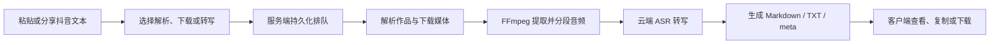

# Douyin Capture

一个面向 Android 与 Windows 的私有化抖音内容提取工具。用户可以粘贴抖音分享文本，或在 Android 分享面板中直接选择本应用，由自托管服务端完成作品解析、媒体下载、音频提取和口播文案转写，并在不同设备间同步任务与结果。

仓库同时提供嵌入 Go 服务的轻量网页版；无需 Flutter，启动服务后可直接用 Windows 浏览器访问。

> 当前状态：M0–M5 功能源码已实现，可进入双端联调；生产部署、安全加固和正式签名安装包属于 M6，项目尚未正式发布。

## 它能做什么

- 解析抖音视频与图文作品，提取标题、作者、描述、封面和媒体信息。
- 下载无水印视频或图文资源。
- 从视频中提取音频，默认通过硅基流动 SenseVoice 生成口播文案；可选阿里云 Paraformer 备用。
- 导出 Markdown、TXT 和结构化 meta JSON 结果。
- 展示排队、解析、下载、音频提取、转写和结果生成进度。
- 支持任务取消、失败重试、历史搜索、筛选和删除。
- Android 可从系统分享面板接收抖音文本，确认后再创建任务。
- Android 与 Windows 共用账号、历史和结果，并提供本地完成/失败通知。
- 网络中断时可查看最近 100 条本地缓存记录，恢复后继续同步。

## 产品流程



所有抖音解析、媒体处理和 ASR 调用都在服务端执行。第三方 API Key 不进入客户端包、接口响应或业务日志。

## 技术架构

| 层级 | 技术与职责 |
|---|---|
| 客户端 | Flutter、Riverpod、Dio、go_router；共用 Android/Windows 业务和 UI |
| API | Go REST API；认证、权限隔离、任务与文件接口 |
| 任务系统 | SQLite 持久化队列、单 Worker、Lease、心跳、取消和故障恢复 |
| 媒体处理 | 服务端下载、FFmpeg/FFprobe、音频分段与临时文件清理 |
| 语音识别 | 服务端从抖音链接下载视频并提取音频，再上传硅基流动 SenseVoice；可选阿里云 Paraformer 备用 |
| 存储 | SQLite 元数据及服务端文件目录，按用户和任务隔离 |
| 安全 | SSRF 防护、短期 Access Token、Refresh Token 轮换、HMAC 签名取源、费用预算上限 |

```text
apps/client_flutter/   Android + Windows Flutter 客户端
services/api_go/       Go REST API、后台 Worker 与管理命令
deploy/                Caddy、systemd 与可选 Docker 部署目录
docs/                  API、运维、安全、ADR 与阶段验收文档
scripts/               Go 与 Flutter 一次性检查脚本
```

完整设计和安全边界见 [产品技术设计](DouyinCapture_Product_Technical_Design.md)，接口契约见 [API 文档](docs/api/README.md)。

## 当前完成度

| 里程碑 | 内容 | 状态 |
|---|---|---|
| M0 | Monorepo、Go 服务与 Flutter 双端工程基线 | ✅ 代码完成 |
| M1 | SQLite、用户认证、Token 轮换和设备会话 | ✅ 代码完成 |
| M2 | 抖音链接解析、缓存和 SSRF 防护 | ✅ 代码完成 |
| M3 | 持久化队列、媒体下载、FFmpeg 和文件管理 | ✅ 代码完成 |
| M4 | ASR、费用预算、音频分段和结果生成 | ✅ 代码完成 |
| M5 | Flutter 登录、提交、进度、结果、历史与设置 | ✅ 代码完成 |
| M6 | 生产部署、安全验收和双端签名安装包 | ⏳ 待实施 |
| M7 | 全文搜索、管理面板和可选增强功能 | 📋 规划中 |

“代码完成”不代表已通过真实环境验收。本仓库当前环境没有执行 Flutter/Go 编译；Android 分享、Windows Toast、真实抖音解析和付费 ASR 仍需在具体设备与生产配置下验证。各阶段记录位于 [docs/acceptance](docs/acceptance)。

## 本地开发

## Windows 本地运行方案

根据是否需要修改源码，可选择两种方式。

### 方式一：源码运行

只使用网页版时需要 Go、FFmpeg/FFprobe 和硅基流动 API Key。首次执行：

```powershell
.\scripts\windows\initialize-local.ps1
.\scripts\windows\start-web.ps1
```

浏览器访问 <http://127.0.0.1:8080>，管理员登录后可在网页配置硅基流动 Key。用户输入的是抖音链接，服务端会自动下载视频、提取临时音频并转写。

Android 与 Windows 客户端源码还需要 Flutter 3.44。Windows 构建需要 Visual Studio 2022 的“使用 C++ 的桌面开发”；Android 构建需要 Android Studio、Android SDK 和 JDK 17。执行 `flutter doctor` 可检查环境。

Android Debug 已允许局域网 HTTP 联调。需要把 `.env` 中的监听地址改为：

```env
HTTP_ADDR=0.0.0.0:8080
```

然后仅在 Windows 防火墙“专用网络”中开放 8080，手机与电脑连接同一局域网，在客户端填写 `http://电脑局域网IP:8080`。Release 版本仍要求 HTTPS。

### 方式二：生成免开发环境运行包

在一台已安装 Go 的构建电脑上执行：

```powershell
.\scripts\windows\build-local-package.ps1 -FFmpegBin C:\ffmpeg\bin
```

输出位于 `dist\douyin-capture-windows-<版本号>`。将整个目录复制给使用者后，对方不需要 Go、Flutter 或 FFmpeg 环境，只需依次运行：

```text
initialize-admin.ps1
start-web.ps1
```

如需同时构建客户端：

```powershell
.\scripts\windows\build-local-package.ps1 `
  -FFmpegBin C:\ffmpeg\bin `
  -IncludeWindowsClient `
  -IncludeAndroidAPK
```

构建客户端的电脑仍需完整 Flutter/Visual Studio/Android 工具链。当前 Android Release 使用调试签名，只适合本地内测，不应作为正式发布包。

### 环境要求

- Go 1.26.5
- Flutter 3.44.0 stable / Dart 3.10+
- FFmpeg 与 FFprobe
- Android API 26+、JDK 17，或 Windows 10 1809+/Windows 11
- 硅基流动 API Key；可选阿里云 DashScope API Key

### 1. 配置服务端

参考 [.env.example](.env.example) 将配置写入当前 Shell、IDE 或进程管理器。真实密钥、Token、`.env` 和签名文件不得提交到仓库。

最少需要确认：

- `DATABASE_PATH`、`DATA_DIR`
- `JWT_SIGNING_KEY_FILE`：至少 32 个随机字节的私有文件
- `SILICONFLOW_API_KEY`：也可由管理员在网页版安全配置
- `PUBLIC_BASE_URL`、`ALIYUN_DASHSCOPE_API_KEY`：仅启用阿里云备用转写时需要
- `ASR_PRICE_PER_MINUTE_CNY`、每日和每月预算上限
- `FFMPEG_PATH`、`FFPROBE_PATH`

启动服务：

```powershell
Set-Location services/api_go
go run ./cmd/server
```

默认监听 `127.0.0.1:8080`，可通过 `GET /health/live` 和 `GET /health/ready` 检查状态。

### 2. 创建账号

密码应写入仅当前用户可读的临时文件，避免出现在命令参数和 Shell 历史中：

```powershell
Set-Location services/api_go
go run ./cmd/admin create-user --username owner --display-name Owner --role admin --password-file <private-file>
go run ./cmd/admin create-user --username collaborator --display-name Collaborator --role user --password-file <private-file>
```

### 3. 运行客户端

只使用网页版时，在 Windows 项目根目录执行：

```powershell
.\scripts\windows\start-web.ps1
```

然后访问 <http://127.0.0.1:8080>。完整说明见 [Windows 网页版使用说明](docs/operations/Windows网页版使用说明.md)。

使用 Flutter 桌面或 Android 客户端时：

```powershell
Set-Location apps/client_flutter
flutter pub get
flutter run -d windows --dart-define=APP_VERSION=0.1.0-dev
```

Android 使用 `flutter run -d <device-id>`。首次打开后，在设置页填写服务端地址；正式环境必须使用 HTTPS。

### 4. 执行检查

```powershell
./scripts/check.ps1
```

Linux/macOS 使用 `./scripts/check.sh`。检查包含 Go 格式、静态分析、测试以及 Flutter 格式、分析和测试，不会访问真实抖音或调用收费 ASR。

更完整的开发说明见 [开发运行说明](docs/operations/开发运行说明.md)。

## 数据与安全

- 服务端只允许访问经过校验的抖音 HTTPS 域名，并逐跳验证重定向和公网 IP。
- 用户只能访问自己的任务和文件，下载接口不接受任意远程 URL。
- Access Token 默认 15 分钟，Refresh Token 默认 30 天并轮换，数据库只保存其哈希。
- ASR 设置单次调用超时、重试上限以及每日/月度费用硬上限。
- 视频和临时音频按保留策略清理；Markdown、TXT 和 meta 随任务保存，删除任务时一并删除。
- 分享内容、Token、API Key、音频正文和供应商原始响应不得写入日志。

## 已知限制

- 尚未提供生产 Caddy/systemd、备份、监控和正式签名安装包。
- 服务重启遇到已提交但未完成的 ASR 任务时，目前会停止自动重放并要求人工核对，避免重复计费；自动续查将在生产部署前补齐。
- 抖音页面结构和 CDN 地址可能变化，真实可用性依赖持续维护解析器。
- 本项目定位为少量可信用户的自托管工具，不包含公开注册、开放下载代理或大规模多租户能力。

## 使用边界

本项目仅用于处理用户有权访问和保存的内容。使用者应遵守平台条款、版权规则及所在地法律，不应将其用于绕过访问控制、批量采集或未经授权的内容分发。

## 路线图

下一阶段 M6 将完成：

- Caddy HTTPS、systemd、备份与清理任务
- 限流、监控、依赖扫描和灾难恢复演练
- ASR 任务自动恢复
- Android APK/AAB 与 Windows 安装包签名及真实设备验收

后续可选增强包括全文搜索、管理员用量面板、自动更新、Obsidian 导出和 AI 摘要。
